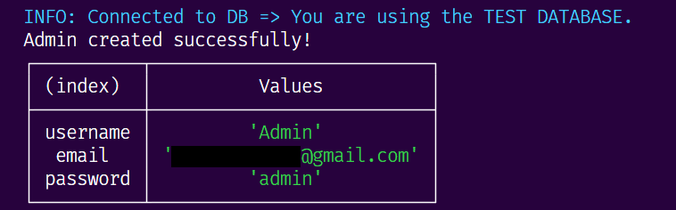
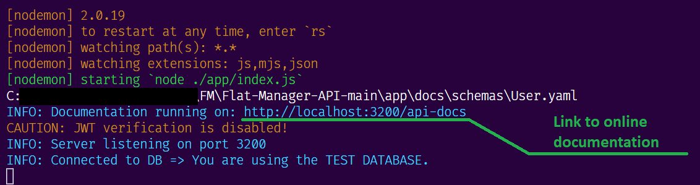
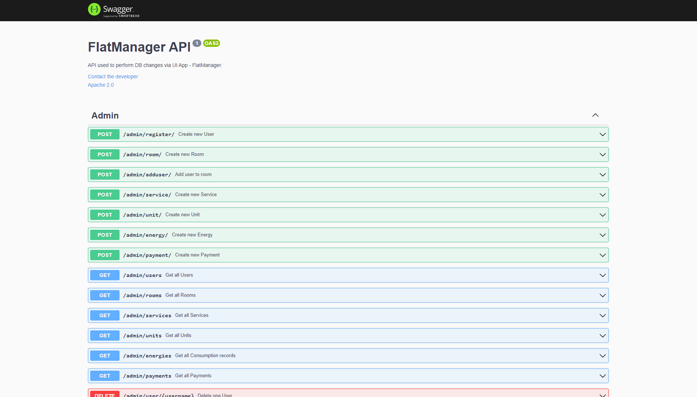
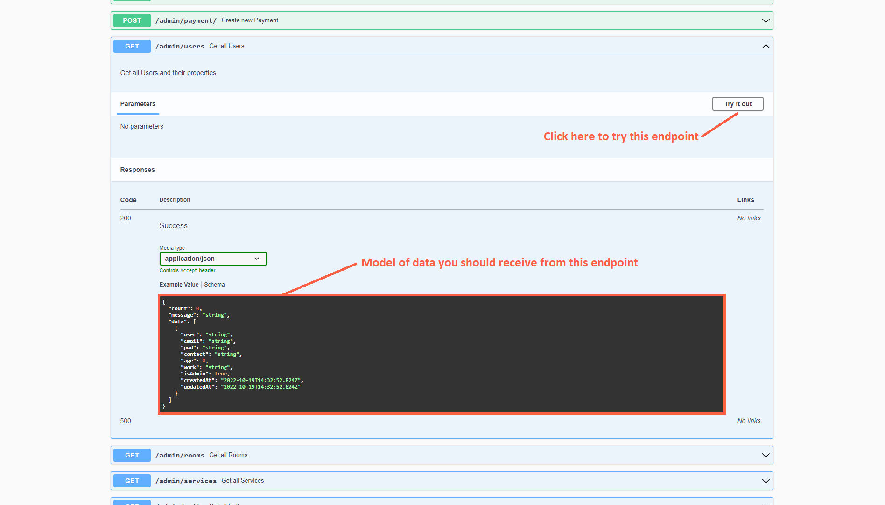
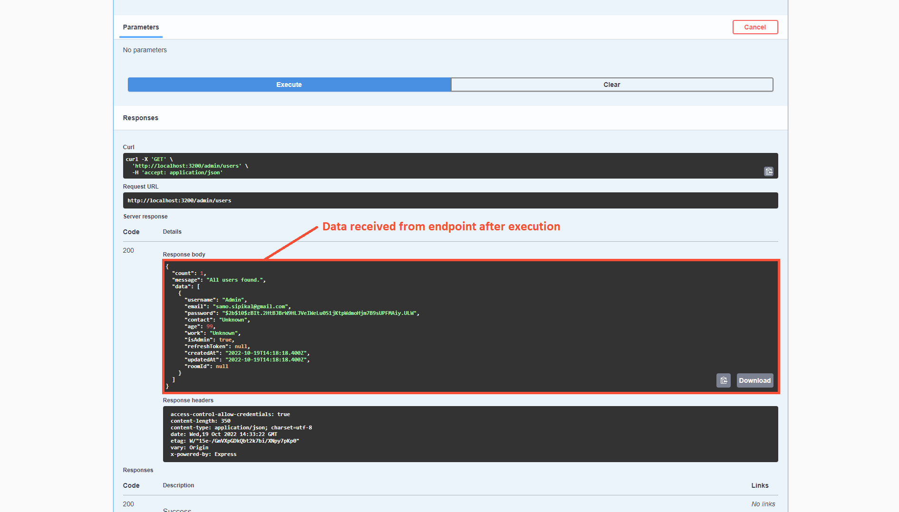
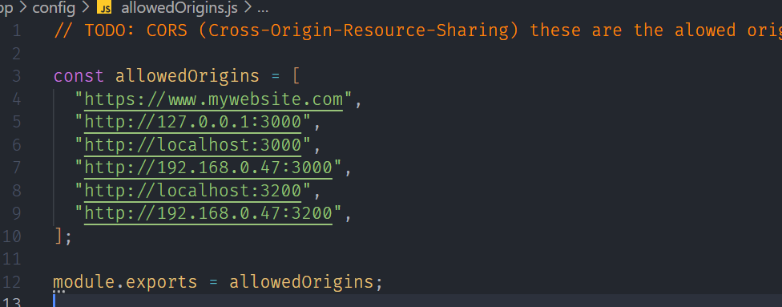
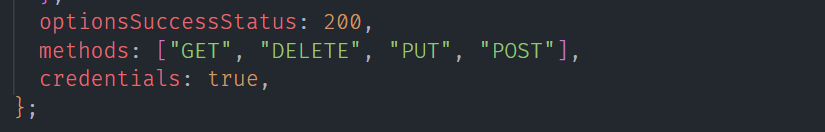

# FlatManager REST API

Flat-Manager is a web application used to help manage housing needs and duties. This API provides communication between the Flat-Manager App and its database.

# Content

[First use guide](#first-use-guide)

[Basic start up](#basic-start-up)

[How to use .env file](#how-to-use-environment-file)

[CORS policy](#cors-policy)

## First use guide

This guide should guide you through all the processes needed to make this API work properly.

1.  Extract downloaded file "Flat-Manager-API-main.zip"

2.  Open extracted folder "Flat-Manager-API-main" in console or in your editor

3.  Write to the console

        > npm install

4.  In folder "Flat-Manager-API-main" create file called ".env" and write the following lines to it

        ACCESS_TOKEN_SECRET="generated_access_token_secret"

        REFRESH_TOKEN_SECRET="generated_refresh_token_secret"

        EXTERNAL_PORT=3200       # Set up external port on which API will be running.

        TEST_DB = "true"         # Switch to testing database.

        LOGGING_MODE = "common"     # "dev" stands for developer colored logging, "common" for basic usage, "off" for no logging and if not explicitly specified then default logging is on.

        DOCS = "true"             # If sets to "true" online documentation is turned on

        SEND_MAILS = "false"      # If sets to "true", everytime new product is added, notification email will be sent to all users

        VERIFY_JWT = "false"      # !! MAY CAUSE UNATHORIZED CONNECTION TO ANY ENDPOINT !! If set to "false" JWT verification is turned off.

        ALTER_MODELS = "false"   # !! MAY CAUSE LOST OF DATA !! If true, alter the table models if they are different from actual models.

        FORCE_MODELS = "false"   # !! MAY CAUSE LOST OF DATA !! If true, destroy all tables and recreate them using new models.

        EMAIL_ADDRESS="email_address@gmail.com" # E-mail address from which emails and notification will be sent to all users.

        EMAIL_PWD="passwordToEmail"     # Password to previous mentioned E-mail address.

5.  Now it's time to create the first user or admin. Run the following command

        npm run createAdmin

    If it was successful you should see message: **Admin created successfully!** and table with Login details (see fig. below)

    

6.  Run command

        npm run dev

7.  Click on link in console to open documentation

    

8.  Try out the API using online documentation

    

    

    

    ## Basic start up

    After following the guideline above, everything should be set up properly. This will ensure that the next time you want to start up the API you don't have to read through all the stuff. In essence, you have two options:

    - **Production start up**

            npm start

    - **Development start up**

            npm run dev

    Among these two types of running the API, the main difference is that when you are working on it (in DEV mode), if something goes wrong in the code, you don't have to restart it manually after the bug correction, you just have to press **CTRL + S** and it will restart it for you.

    ## How to use environment file

    ### Access & Refresh token secrets

    In order to create new tokens while still ensuring the security of previous tokens, the Access token and Refresh token secrets should be random strings. If you want to generate a really strong secret you can use the following commands to generate random strings using Node.

            > node

            > require('crypto').randomBytes(64).toString('hex')

    To exit Node press twice **CTRL + C**.

    ### External port

    External port sets the port on which API will be running. If you want to use this API with FlatManager App, you have to set this port in **Flat-Manager-App > src > api > axios.js > BASE_URL** to be same.

    ### Test DB

    This variable is used for testing the API and its functionalities. When performing any kind of API testing, you should set this variable to "true", so that you switch to the "test-database", to prevent damaging data already saved on the real database.

    ### Logging mode

    Logging mode provides a few different ways to log to the console for any request or information.

        "common" => ':remote-addr - :remote-user [:date[clf]] ":method :url HTTP/:http-version" :status :res[content-length]'

        "dev" => ':method :url :status :response-time ms - :res[content-length]'

        "off" => No logging

        "" (default) => ':method :url :status :res[content-length] - :response-time ms'

    ### Docs

    Docs is used to provide documentation of the API. If it's set to "true" you will see the following message in the console after running the API.

        > INFO: Documentation running on: http://localhost:EXTERNAL_PORT/api-docs

    In case you press **CTRL** and click on the provided link, you will automatically be redirected to the online documentation page. Here, you can find all the details about the API's endpoints.

    If it's set to "false" the online documentation server is down.

    ### Send mails

    After creating new products in the product section, this feature sends email notifications to all signed users. Users will not receive an email if it's set to "false".

    ### Verify JWT

    When you want to test API for any use, it's not really practical to Log In and Log Out all the time. This feature is used to turn off JWT verification when set to "false". Keep in mind that this variable should always be set to "true" in production. If you change it to "false" you will also see the following message in the console:

        > CAUTION: JWT verification is disabled!

    if it's set to "true" you should see

        > SAFE: JWT verification is enabled.

    ### Alter models

    After every change in database models in this API, you should set this variable to "true" to apply the changes to DB models. Setting this variable to "true" can result in data loss.

    ### Force models

    This feature should be set to "true" only in case of big changes to the DB models. **If it's set to "true" it will automatically delete all DB data!** It's necessary to have any kind of backup for DB before running API with this setting.

    ### Email address

    Users will receive all mails from this email address.

    ### Email password

    Password to the previous email address.

    If you want to use a **GMAIL** account, you should allow 2-Step verification in it (use this link: https://support.google.com/accounts/answer/185839?hl=en&co=GENIE.Platform%3DDesktop).

    With the google tutorial in the previous link, you can generate a password for third-party applications and then use it as a password for this app.

    ## CORS policy

    If you want to use this API you have to set up the CORS policy. First, you should go to the main folder "Flat-Manager-API-main" and then to the file: **./app/config/allowedOrigins.js**. In this file, you will find preset origins, as can be seen below.

    

    If you want to run your FrontEnd or another API on a different host and port you should add it to the **allowedOrigins**.

    Also if you want to add some endpoints into this API you should go to the file: **./app/config/corsOptions.js** and set up all allowed methods.

    
